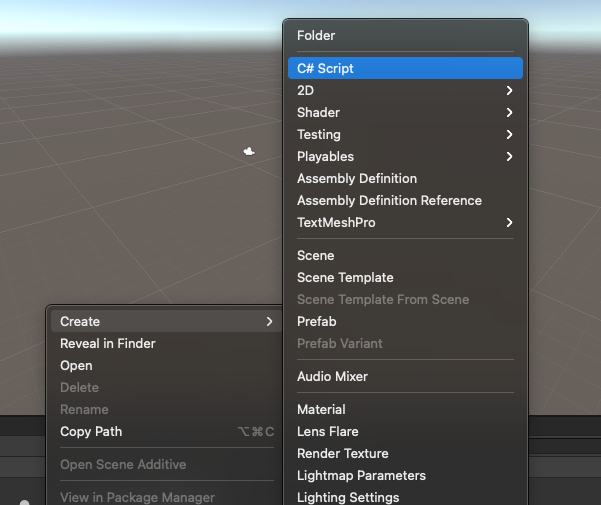
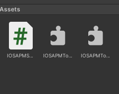

* 在unity项目的Assets目录下创建C#脚本


* 将IOSAPMTool.h和IOSAPMTool.m拉到Assets文件夹下面，按照如图配置，只需保留ios选项



* C#脚本添加该行
```
using System.Runtime.InteropServices;  //DllImport的库
```

* 添加函数,getAppUsedCPU函数名与OC文件的函数名一致
```
[DllImport("__Internal")]
internal extern static float getAppUsedCPU();
```

* 调用，在Start当中调用, 指定平台一定要用#if UNITY_IPHONE和#endif包起来
```
    void Start()
    {
        #if UNITY_IPHONE 
        float app_cpu_used = GetProcessUsedCPU();
        float app_memory_used = GetMemoryFootprint();
        float sys_memory_all = GetDeviceTotalMemory();
        float sys_memory_free = GetDeviceFreeMemory();
        float sys_memory_used = GetDeviceUsedMemory();
        double battery_level = GetBatteryLevel();
        float ava_memory = GetDeviceAvailableMemory();
        #endif
    }
```

* 最后快捷键command + shift + B进行编译构建为xcode项目，运行xcode项目

* 接口
```
GetProcessUsedCPU();         //返回当前进程占用的cpu, %
GetMemoryFootprint();      //返回当前进程使用的内存, 单位M
GetDeviceTotalMemory();      //返回设备总的内存, 单位M
GetDeviceFreeMemory();       //返回设备剩余的内存, 单位M
GetDeviceUsedMemory();       //返回设备已经使用的内存, 单位M
GetBatteryLevel();          //返回当前电池电量，%
GetDeviceAvailableMemory();  //该接口返回的数值等于设备总内存减去脏内存的大小,仅适用于ios 13.0以上的版本， M
```