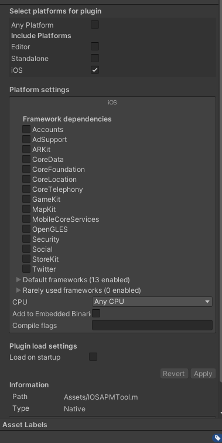

### unity3d与ios的交互
* IOSAPMTool.h和IOSAPMtool.m文件写了要被调用的函数。（函数要用extern "C"， 因为C#只能调用C函数，使用时将这两个文件拉到创建的unity项目的Assets目录里面，如下图进行配置）


* bridge.cs是unity的c#脚本，负责调用IOSAPMtool里面的函数(在unity当中的Assets右键点击空白区域选择create创建c#脚本)

* DllImport为一个Attribute，目的是通过非托管方式将库中的方法导出到C#中进行使用。
```
using System.Runtime.InteropServices;  //DllImport的库

[DllImport("__Internal")]
internal extern static float getAppUsedCPU();
```

* 在Start当中调用, 指定平台一定要用#if UNITY_IPHONE和#endif包起来
```
        #if UNITY_IPHONE 
        float app_cpu_used = getAppUsedCPU();
        int app_memory_used = getAppUsedMemory();
        int sys_memory_all = getSysAllMemory();
        int sys_memory_free = getSysFreeMemory();
        int sys_memory_used = getSysUsedMemory();
        double battery_level = getBatteryLevel();
        recvFromUnity(app_cpu_used, app_memory_used, sys_memory_all, sys_memory_free, sys_memory_used, battery_level);
        #endif
```

* 之后将bridge.cs拉到Main Camera里面
* 选择file -> build and run即可生成xcode文件